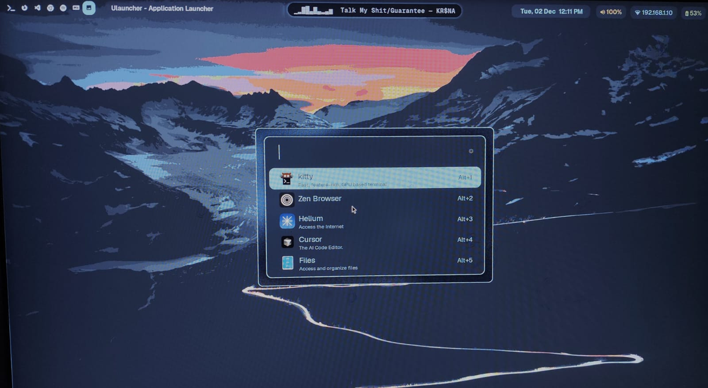
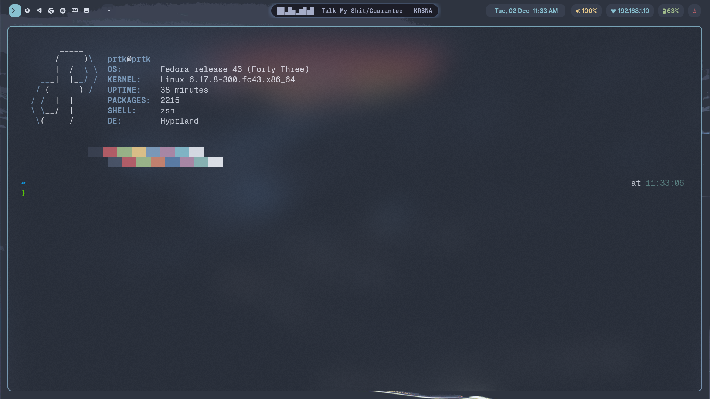
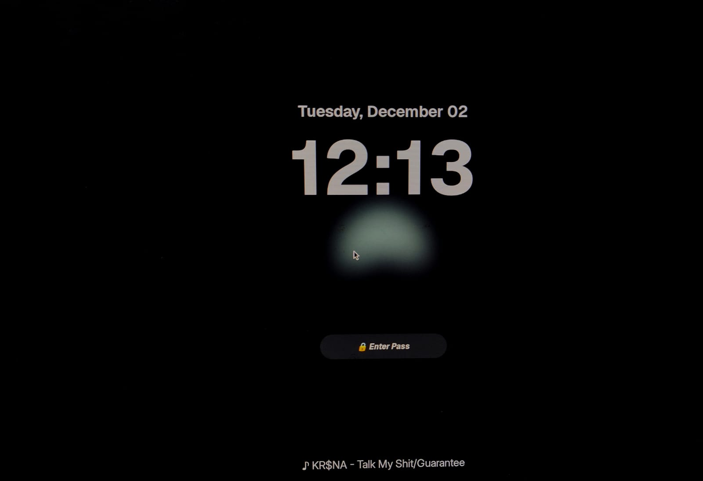
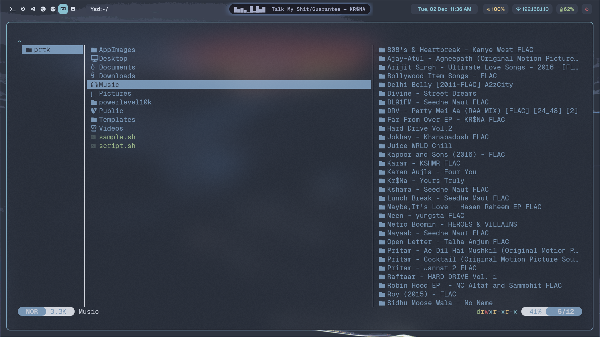

This repository contains the complete configuration files for my Fedora-based Linux setup. It includes window manager configurations, terminal themes, UI and UX improvements, CLI utilities, development environment settings, and various system scripts. The goal of this repository is to maintain a reproducible, documented, and modular system configuration that can be deployed consistently on any machine.

Most directories directly mirror the structure inside `$HOME/.config/`.

Download or clone the repository here:  
https://github.com/xyzprtk/dotfiles

## System Information

**Operating System**  - Fedora 43 Workstation

**Window Manager and Display**  
**Hyprland:** Dynamic tiling Wayland compositor used as the main window manager.  
**Hyprpaper:** Wallpaper utility for Wayland, used for static and themed backgrounds.  
**Hyprlock:** Lockscreen utility for Hyprland.  
**Hypridle:** Idle management utility used for screen locking and system suspend events.

**Terminal Emulators**  
**Alacritty:** GPU-accelerated terminal emulator with extensive theme support.  
**Kitty:** GPU-based terminal emulator configured with custom themes and font preferences.  

**Monitoring Utilities**  
**htop and btop:** Terminal-based system monitoring utilities.

**Shell and System Tools**  
**Fastfetch:** Fast hardware and system information display tool (used instead of Neofetch).  
**Ulauncher:** Application launcher with custom themes.  
**Yazi:** Terminal-based file manager used for navigation inside the terminal.  
**Scripts:** System utilities for power control, WiFi selection, workspace indicators, wallpaper automation, and system fetch.

**Editor**  
Neovim with a Lua-based modular configuration.
Cursor for AI assisted Coding

**Fonts**  
**Geist Mono:** Primary monospace font for the Kitty terminal.  
**Geist:** UI and general-purpose font.  
**JetBrains Mono Nerd Font:** Used for icons, glyphs, and terminal visuals across Waybar and Neovim.

## Repository Structure

**alacritty**
Contains `alacritty.toml` and a large set of terminal themes and preview images.

**background**
Wallpapers used with Hyprpaper.

**btop**
Configuration for the Btop system monitor.

**fastfetch**
System information fetch configuration.

**htop**
Configuration file for Htop.

**hypr**
Hyprland ecosystem configuration including:

- `hyprland.conf` for window management  
- `hypridle.conf` for idle management  
- `hyprlock.conf` for lockscreen behavior  
- `hyprpaper.conf` for wallpapers  
- `hyprlock/` for lockscreen assets and helper scripts

**kitty**
Kitty terminal configuration including the active theme, backups, and font settings.

**nvim**
My Neovim configuration written in Lua.  
Includes directories for editor defaults, keymaps, plugin configuration, and core modules.

**scripts**
Utility scripts used throughout the system.  
Includes wallpaper rotation, power menu, WiFi selector, system fetch helpers, and workspace indicators.

**ulauncher**
Ulauncher configuration including themes, settings, and keyboard shortcuts.  
Contains a full Nord theme inside `user-themes`.

**waybar**
Waybar configuration with modules, individual scripts, and the stylesheet defining the visual layout.

## Screenshots

### Desktop  

### Waybar  

### Ulauncher

### Alacritty

### Hyprlock 

### Yazi

## Installation and Usage

Clone the repository:
https://github.com/xyzprtk/dotfiles

**Using GNU Stow for symlinks:**

`stow alacritty`

`stow hypr`

`stow waybar`

`stow kitty`

`stow nvim`

**Manual installation:**

`cp -r alacritty ~/.config/`

`cp -r hypr ~/.config/` 

`cp -r waybar ~/.config/`

`cp -r kitty ~/.config/`

`cp -r nvim ~/.config/`

Make sure all required packages and fonts are installed before launching the environment.

